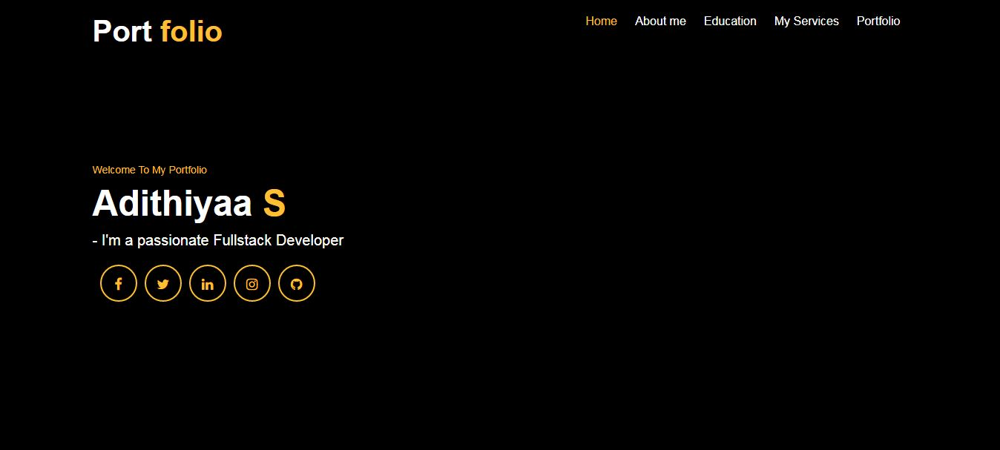
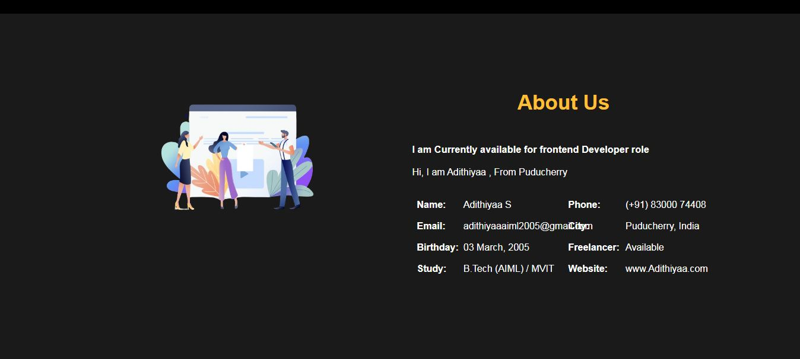
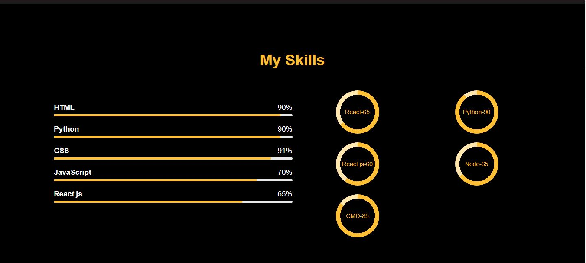
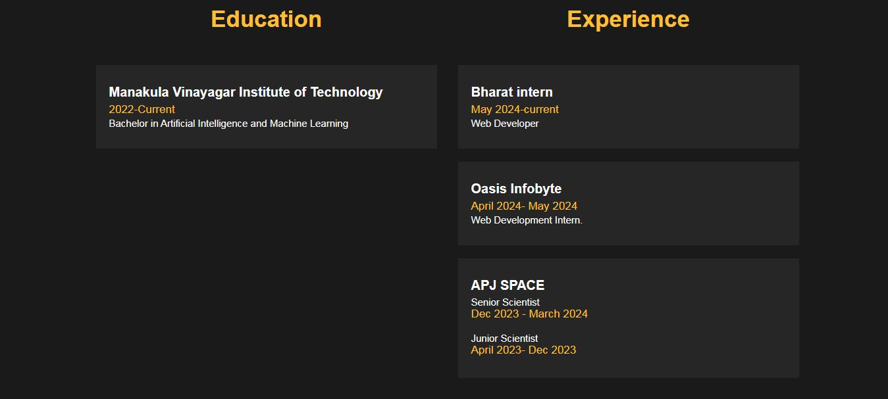
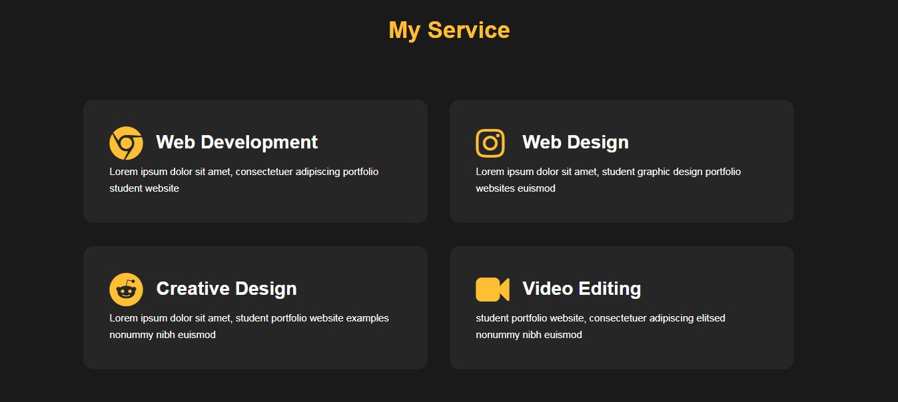
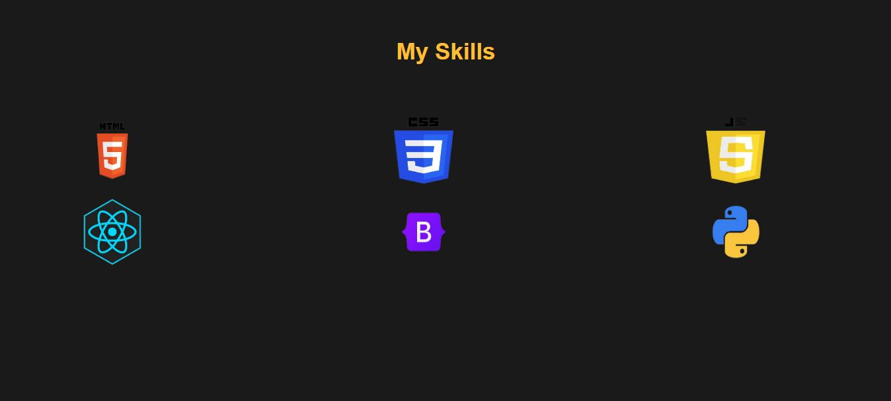
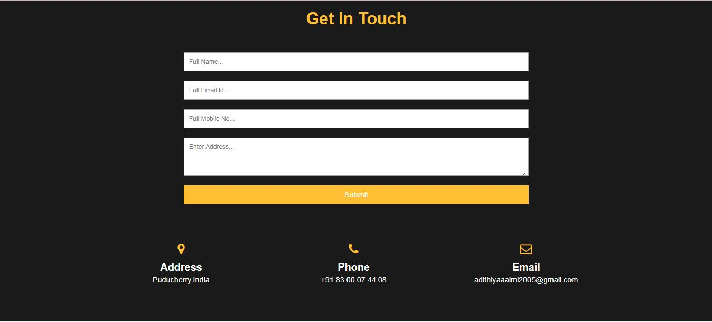

# Personal Portfolio Website

Welcome to my personal portfolio website repository! This project showcases my work, skills, and experiences in web development.

## Features

- Responsive design that looks great on all devices
- Sections for About, Projects, Skills, Experience, and Contact
- Smooth scrolling and interactive elements
- Easy to customize and extend

## Getting Started

### Prerequisites

- A web browser
- Basic knowledge of HTML, CSS, and JavaScript

### Installation

1. Clone the repository to your local machine:
   ```bash
   git clone https://github.com/Adithiyaa22/portfolio.git
2. Navigate to the project directory:
   ```bash
   cd portfolio
3. Open index.html in your web browser to view the portfolio:
   ```bash
   open index.html

### Customization
To personalize the portfolio with your own information:

Open index.html and replace the placeholder content with your own details.
Customize the styles in styles.css to match your preferences.
Update the projects and images in the appropriate sections.

### Contributing
Contributions are welcome! If you have any suggestions or improvements, feel free to fork the repository, make your changes, and submit a pull request.

### License
This project is licensed under the MIT License 

# Screenshots

 <br>
 <br>
 <br>
 <br>
 <br>
 <br>
 <br>
